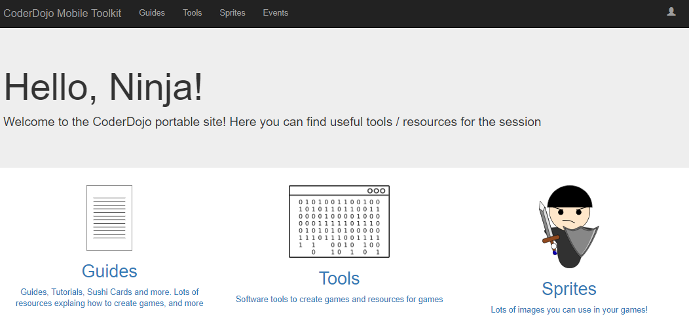

# CoderDojo Mobile Toolbox

The CoderDojo Mobile Toolbox is a web application that supports / simplifies / enriches you CoderDojo sessions.

By installing it on a Raspberry Pi configured as a wireless hotspot, you'll have a completely stand-alone, portable solution: Ninjas can use the web app even where there is no existing wireless networks. 

Currently the application is in an early development stage, but it has already been used in real CoderDojo sessions with 15+ participants.

## Current features

- Tutorial repository with resources (e.g. sprites, sounds)
- Sprite gallery
- Software repository (e.g. Scratch installer) 
- Event Management

## Trying It

Want to try it? Follow the [User Guide](https://coderdojo-mobile-toolbox.readthedocs.io/en/latest/) 

## Next features

We plan to add more features in Q3 2018. Next features will probably be:

- Event management with Ninja check-in, also via QR Code
- Project Uploading, Rating, Commenting by Ninjas

## Contributing

Want to contribute? 

You can:

- Use the toolkit and [suggest features / report issue](https://github.com/CoderDojoBrianza/CoderDojo-Mobile-Toolbox/issues)
- Implement new features / fixes yourself and create pull requests!

